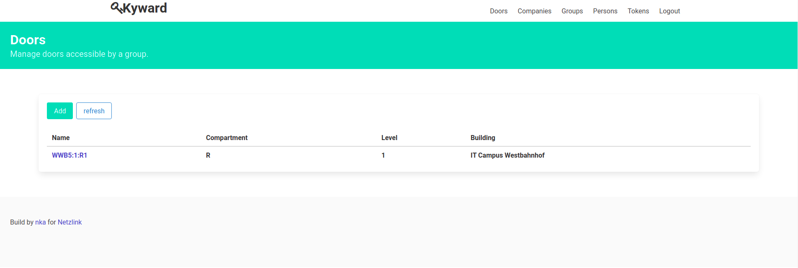

# Kyward
[](https://codecov.io/gh/nk-designz/kyward.rs)
[](https://github.com/Netzlink/kyward.rs/actions/workflows/docker-image.yml)  
A simple token management tool written in almost completly rust.

## Screenshot
 _Doors Section_


## Setup 
 _Dev_
```bash
make run
```
_Docker_
```bash
docker build -f Dockerfile . -t kyward
docker run --rm -p 8000:8000 kyward:latest
```

## Disclamer
this project is under heavy development and not ready for deployment.
